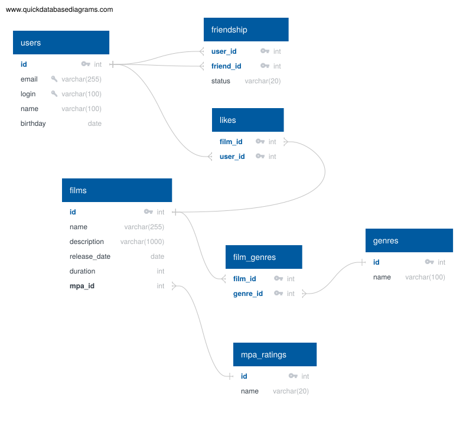

# java-filmorate

## Схема базы данных



### Описание таблиц

- **users** - пользователи приложения. Содержит профиль: email, логин, имя и дату рождения.
- **friendship** - связь «дружба» между пользователями. Пара `(user_id, friend_id)` уникальна. Поле `status` хранит статус заявки:
  - `UNCONFIRMED` - один пользователь отправил запрос на добавление в друзья, второй ещё не ответил;
  - `CONFIRMED` - дружба подтверждена обеими сторонами.
- **films** - фильмы. Основная информация о фильме: название, описание, дата релиза, длительность, а также ссылка на возрастной рейтинг MPA.
- **mpa_ratings** - справочник возрастных рейтингов Ассоциации кинокомпаний (G, PG, PG-13, R, NC-17).
- **genres** - справочник жанров (Комедия, Драма, Мультфильм, Триллер, Документальный, Боевик).
- **film_genres** - связующая таблица «фильмы - жанры». У фильма может быть несколько жанров.
- **likes** - лайки пользователей: пара `(film_id, user_id)` уникальна, поэтому один пользователь может поставить фильму только один лайк.

### Примеры запросов

Справочные данные:

```sql
INSERT INTO mpa_ratings (id, name) VALUES
(1, 'G'), (2, 'PG'), (3, 'PG-13'), (4, 'R'), (5, 'NC-17');

INSERT INTO genres (id, name) VALUES
(1, 'Комедия'), (2, 'Драма'), (3, 'Мультфильм'),
(4, 'Триллер'), (5, 'Документальный'), (6, 'Боевик');
```

Получить все фильмы:

```sql
SELECT * FROM films;
```

Получить всех пользователей:

```sql
SELECT * FROM users;
```

Получить фильм по идентификатору:

```sql
SELECT * FROM films WHERE id = 1;
```

Получить пользователя по идентификатору:

```sql
SELECT * FROM users WHERE id = 1;
```

Топ N самых популярных фильмов (по количеству лайков):

```sql
SELECT f.id, f.name, COUNT(l.user_id) AS likes_count
FROM films AS f
LEFT JOIN likes AS l ON f.id = l.film_id
GROUP BY f.id, f.name
ORDER BY likes_count DESC
LIMIT 10;
```

Поставить лайк фильму:

```sql
INSERT INTO likes (film_id, user_id) VALUES (1, 1);
```

Убрать лайк:

```sql
DELETE FROM likes WHERE film_id = 1 AND user_id = 1;
```

Добавить пользователя в друзья (отправить заявку):

```sql
INSERT INTO friendship (user_id, friend_id, status) VALUES (1, 2, 'UNCONFIRMED');
```

Подтвердить дружбу:

```sql
UPDATE friendship SET status = 'CONFIRMED'
WHERE user_id = 1 AND friend_id = 2;
```

Список друзей пользователя:

```sql
SELECT u.*
FROM friendship AS f
JOIN users AS u ON u.id = f.friend_id
WHERE f.user_id = 1;
```

Список общих друзей двух пользователей:

```sql
SELECT u.*
FROM friendship AS f1
JOIN friendship AS f2 ON f1.friend_id = f2.friend_id
JOIN users AS u ON u.id = f1.friend_id
WHERE f1.user_id = 1 AND f2.user_id = 2
  AND f1.status = 'CONFIRMED'
  AND f2.status = 'CONFIRMED';
```

Список фильмов, которым поставил лайк пользователь:

```sql
SELECT f.*
FROM likes AS l
JOIN films AS f ON f.id = l.film_id
WHERE l.user_id = 1;
```

Жанры фильма:

```sql
SELECT g.*
FROM film_genres AS fg
JOIN genres AS g ON g.id = fg.genre_id
WHERE fg.film_id = 1;
```
